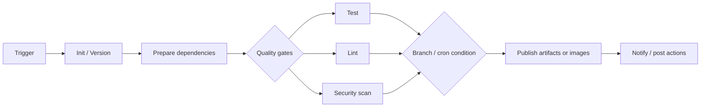

# AGENTS.md

## Purpose

- This repo is a Jenkins 80/20 learning sandbox, not a production app.
- Keep changes tutorial-friendly: small `Jenkinsfile`, shell scripts, diagrams, tables, and focused examples beat exhaustive Jenkins coverage.
- When teaching, act as a senior DevOps engineer: explain CI/CD system behavior, tradeoffs, and failure modes, not just syntax.
- Use the Feynman technique: plain-language analogy first, concrete Jenkins example second, real-world reference third.

## High-Value References

- Start with `README.md`; it defines the learning path and the intended project shape.
- Use `/Users/khai.nguyen/Codes/dynatrace/automation-server/Jenkinsfile` as the backend/service CI reference.
- Use `/Users/khai.nguyen/Codes/dynatrace/worktree/app/ps-24839/Jenkinsfile` as the frontend/app CI reference.
- When explaining real Jenkins usage, compare this sandbox pipeline against those two Jenkinsfiles instead of inventing generic examples.

## Teaching Bias

- The user is a visual learner; prefer Mermaid diagrams, ASCII flow charts, and comparison tables when explaining pipeline flow.
- Tie every lesson back to the common CI/CD loop: `trigger -> checkout -> prepare -> test -> build -> scan -> publish -> notify`.
- Explain complex Jenkinsfiles by reducing them to stage intent, branch conditions, agents/containers, secrets, artifacts/reports, and post actions.
- Avoid deep Groovy details unless they directly explain a real Jenkinsfile behavior.

## Real Jenkinsfile Patterns To Highlight

| Pattern       | automation-server                                                                     | automation-app                                                                                            |
| ------------- | ------------------------------------------------------------------------------------- | --------------------------------------------------------------------------------------------------------- |
| Agent model   | Kubernetes agent from `.ci/node.yaml`, default `worker`, heavy Docker container usage | Kubernetes agent from `.ci/node.yaml`, default `node24`, switches to `playwright` and ECR agent as needed |
| Versioning    | `git describe`, branch-aware bumping, service-specific release tags                   | `git describe`, branch-aware bumping, app version injected into `package.json`                            |
| Skip builds   | `[skip ci]` in commit message aborts as `NOT_BUILT`                                   | `[skip ci]` in commit message aborts as `NOT_BUILT`                                                       |
| Parallelism   | Builds/pulls images and runs test/security branches in parallel                       | Runs build, lint, unit, component, and E2E paths with conditional parallel stages                         |
| Secrets       | Vault plus Jenkins credentials for Slack, Harbor, Snyk, Sonar, app registry           | Vault plus Jenkins credentials for deploy, signing, publishing, E2E users, Snyk, Sonar, ECR               |
| Reports       | Publishes JUnit and coverage XML artifacts                                            | Publishes JUnit plus Playwright/coverage HTML reports                                                     |
| Release path  | Tags, pushes/signs Docker images, publishes Helm charts, triggers Renovate            | Tags, publishes app to hub managers, publishes Helm charts to ECR, triggers Renovate                      |
| Notifications | Slack on unsuccessful master/release builds                                           | Slack for failed interval tests, docs lint, and master failures                                           |

## Visual Model To Reuse

## Sandbox Implementation Guidance

- Keep the first local pipeline intentionally tiny: `Checkout`, `Test`, `Build`, `Archive`, `Post`.
- Prefer shell scripts under `scripts/` so Jenkins concepts stay visible and commands are easy to run locally.
- Add complexity only when it maps to a real reference pattern: parameters, credentials, parallel stages, JUnit reports, artifact archiving, branch conditions.
- Do not add real working secrets, endpoints, or publishing actions to this sandbox; reference them conceptually only.
- If adding container examples, include both Docker and Podman commands because local setup may use either.

## Commands

- There is currently no package manager, test framework, or build tool in this sandbox.
- For local script verification after adding scripts, prefer direct commands such as `sh scripts/test.sh` and `sh scripts/build.sh`.
- If executable permissions matter for Jenkins examples, use `chmod +x scripts/*.sh` and mention why Jenkins agents need it.

## Explanation Checklist

- For any Jenkinsfile lesson, show the minimal sandbox version first.
- Then map it to the relevant real Jenkinsfile lines or stage names.
- Include a short diagram or table when comparing concepts.
- Call out what runs only on `main`, `release/*`, PRs, or cron-triggered builds.
- Call out which failures are hard failures versus `catchError` quality gates that continue but mark a stage/build unstable or failed.
